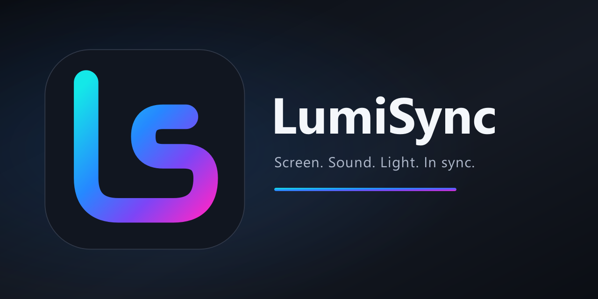
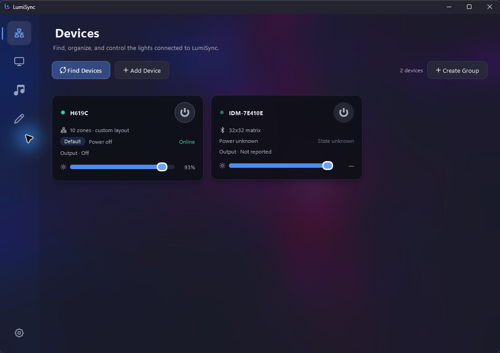
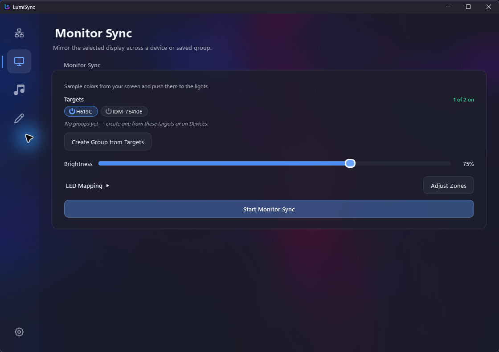
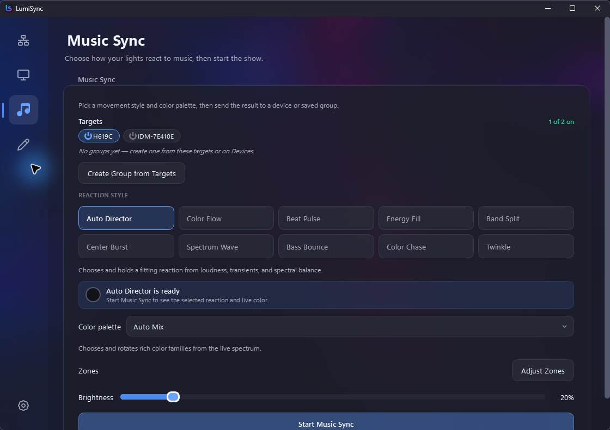

<div align="center">



# LumiSync

**Synchronize Govee, iDotMatrix, and LSC/Tuya lights with your screen or music.**

Visit the website: [lumisync.minlor.net](https://lumisync.minlor.net)

[](https://www.python.org/downloads/)
[](https://pypi.org/project/lumisync/)
[](https://opensource.org/licenses/MIT)
[](https://github.com/Minlor/LumiSync/stargazers)

[Features](#features) • [Installation](#installation) • [Usage](#usage) • [Development](#development) • [Roadmap](#roadmap)

</div>

---

> [!NOTE]
> This project is in active development. Windows is fully supported; Linux X11 is partial, macOS/Wayland are WIP.

## ✨ Features

| Feature | Description |
|---------|-------------|
| 🖥️ **Monitor Sync** | Sample colors from screen regions and sync to your LED strip in real-time |
| 🎵 **Music Sync** | React to audio with dynamic color patterns |
| 🎨 **Color Control** | Set custom colors and brightness directly from the app |
| 🖌️ **Modern GUI** | Blue-accented PySide6 interface with selectable Acrylic, Mica, and Solid Dark window materials |
| 🔌 **Multi-Vendor** | Govee (LAN), iDotMatrix pixel panels (Bluetooth), and LSC/Tuya WiFi lights |
| 🔍 **Auto-Discovery** | Automatically finds Govee devices on your LAN via UDP broadcast |
| ⚡ **Low Latency** | Direct LAN communication, no cloud required |

### Supported devices

Every device family works out of the box — a single `pip install lumisync` (or
the packaged Windows build) bundles all transports, no extras to remember.

| Family | Transport | Notes |
|--------|-----------|-------|
| Govee strips/bulbs | LAN (UDP) | Enable "LAN Control" in the Govee app |
| iDotMatrix panels | Bluetooth LE | Pixel displays; see [docs](docs/idotmatrix-ble-research.md) |
| LSC / Tuya WiFi lights | LAN (Tuya local) | Needs the device's local key — see [docs](docs/lsc-tuya-research.md) |

## 📸 Screenshots

### Devices

<div align="center">


<sub>Discover, organize, and directly control LAN and Bluetooth lights.</sub>
</div>

### Monitor and music sync

<table>
  <tr>
    <td width="50%">
      
    </td>
    <td width="50%">
      
    </td>
  </tr>
  <tr>
    <td align="center"><strong>Monitor Sync</strong><br/>Map display colors across one or more lights.</td>
    <td align="center"><strong>Music Sync</strong><br/>Choose reactions and palettes or let Auto Director decide.</td>
  </tr>
</table>

## 📦 Installation

**Requirements:** Python 3.11 or higher

### From PyPI (Recommended)

```bash
pip install lumisync
```

### From GitHub (Latest)

```bash
pip install git+https://github.com/Minlor/LumiSync.git
```

### Development Install

```bash
git clone https://github.com/Minlor/LumiSync.git
cd LumiSync
pip install -e .
```

### Prebuilt downloads

- **Windows** — a portable `.zip` and a single-file `.exe` are attached to each
  [GitHub release](https://github.com/Minlor/LumiSync/releases).
- **Linux** — an `x86_64` **AppImage** is attached to each release; `chmod +x`
  it and run. Build it yourself with `tools/build_linux.sh` (needs Python 3.12+
  and `appimagetool` deps). A Flatpak is scaffolded in `packaging/flatpak/` but
  not yet finished.

> **Platform notes:** Windows is fully supported. On Linux, device control,
> music sync, and manual control work on X11 and Wayland; **screen (monitor)
> sync currently requires an X11/Xorg session** — Wayland capture is planned.

## 🚀 Usage

### Launch the App

```bash
lumisync
```

The GUI opens by default. The legacy interactive terminal is still available
with `lumisync --cli`; direct headless modes are available through
`lumisync --monitor` and `lumisync --music`.

### Quick Start

1. **Discover devices** — Click "Discover Devices" for Govee LAN lights or "Scan Bluetooth" for pixel panels.
2. **Select your lights** — Choose one or more devices from the Devices page.
3. **Control your lights** — Set color, brightness and power directly from each device card.
4. **Start syncing** — Open Monitor Sync or Music Sync, choose the target devices and start the mode.

### Interface

- **Devices** — Discover, add and control LAN or Bluetooth lights; multi-select devices for bulk actions.
- **Monitor Sync** — Map display colors to selected devices, groups, zones, and custom LED regions.
- **Music Sync** — Choose reactions, palettes, targets and brightness, or use Auto Director.
- **Draw** — Paint still images or frame-by-frame animations for compatible iDotMatrix panels.
- **Settings** — Choose Acrylic, Mica, or Solid Dark; select a display, tune sync behavior, manage groups, startup and system-tray options.

### Configuration

- **LED Mapping** - Customize which screen regions map to which LEDs
- **Brightness** - Adjust per-mode brightness (10-100%)
- **Display Selection** - Choose which monitor to capture (multi-monitor support)
- **Sync Tuning** - Tune smoothing, saturation, frame rate, gamma and music response

## 🛠️ Development

### Project Structure

```
lumisync/
├── lumisync.py          # Entry point & CLI
├── connection.py        # Govee UDP protocol (port 4001/4002)
├── devices.py           # Device discovery & caching
├── config/options.py    # Runtime configuration
├── sync/                # Monitor & music sync engines
├── gui/                 # PySide6 application
│   ├── controllers/     # Business logic (QObject + pyqtSignal)
│   ├── views/           # UI components
│   └── widgets/         # Reusable widgets
└── utils/               # Logging, colors, file ops
```

### Run Tests

```bash
python -m unittest discover -s tests
```

### Brand and documentation assets

The production app icon, transparent mark, tray variants, Windows `.ico`, and
GitHub banner live in [`assets/brand`](assets/brand). Regenerate the complete
icon set from its single SVG geometry with:

```bash
python tools/generate_brand_assets.py
```

Fresh README screenshots can be captured from the real PySide application on
Windows with:

```bash
python tools/capture_readme_screenshots.py --material acrylic
```

### Platform Support

| Platform | Screen Capture | Status |
|----------|---------------|--------|
| Windows | dxcam | ✅ Full support |
| Linux (X11) | mss | ⚠️ Partial |
| Linux (Wayland) | - | 🚧 WIP |
| macOS | - | 🚧 WIP |

## 🗺️ Roadmap

- [x] Multi-device support
- [ ] Wayland & macOS screen capture
- [x] Basic color control mode
- [ ] Custom sync algorithms
- [ ] Plugin system for community extensions

## 🙏 Credits

- **[Wireshark](https://wireshark.org/)** — Protocol analysis
- See [pyproject.toml](pyproject.toml) for all dependencies

## 📄 License

[MIT](LICENSE) © Minlor

---

<div align="center">

**[minlor.net](https://minlor.net)** · **[GitHub @minlor](https://github.com/minlor)**

⭐ Star this repo if you find it useful!

</div>
