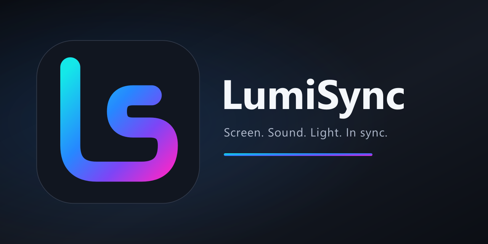
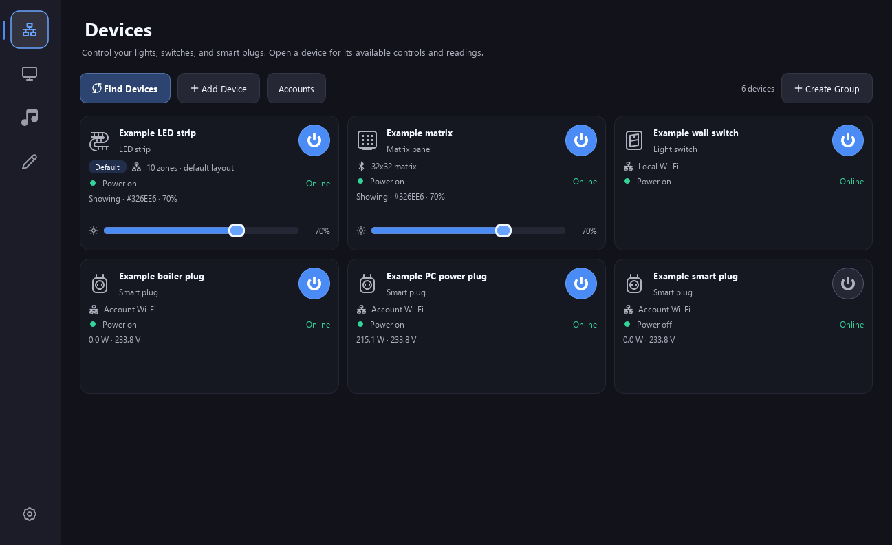
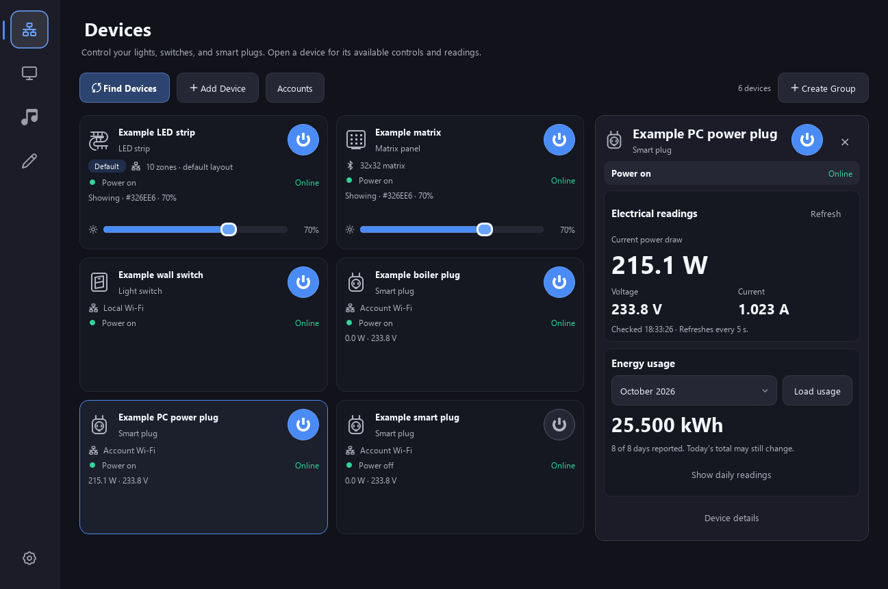
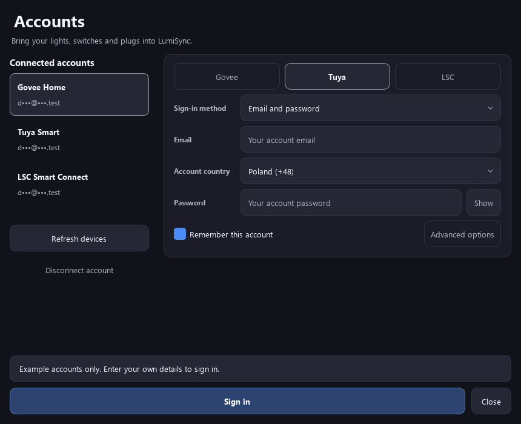
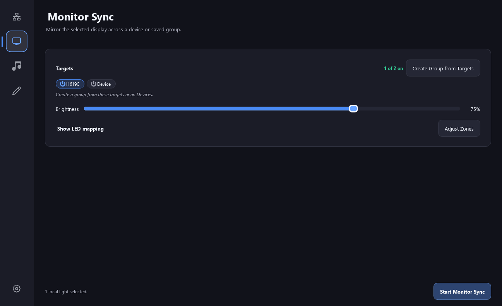
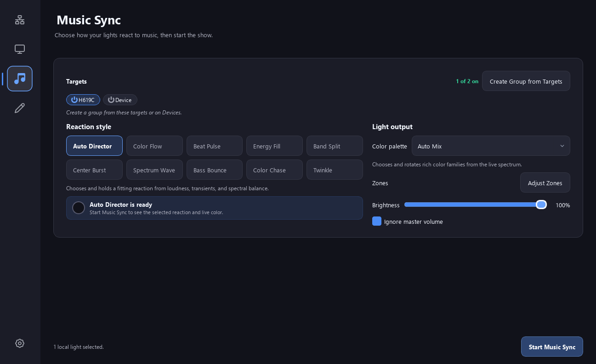

<div align="center">



# LumiSync

**Control your lights, switches and smart plugs. Sync local lights with your screen or music.**

Visit the website: [lumisync.minlor.net](https://lumisync.minlor.net)

[](https://www.python.org/downloads/)
[](https://pypi.org/project/lumisync/)
[](https://opensource.org/licenses/MIT)
[](https://github.com/Minlor/LumiSync/stargazers)

[Features](#features) • [Installation](#installation) • [Usage](#usage) • [Development](#development) • [Roadmap](#roadmap)

</div>

---

> [!NOTE]
> This project is in active development. Windows is fully supported; Linux X11 is partial, macOS/Wayland are WIP.

## What's new in 0.8.0

Sign in with your own Govee, Tuya Smart or LSC account, see controls suited to
each device, and check live power readings and monthly energy usage on supported
plugs. Device layouts adapt to your window, and rapid light adjustments have
safer command queues and thread cleanup. See the [release notes](docs/releases/0.8.0.md).

## Features

| Feature | Description |
|---------|-------------|
| **Monitor Sync** | Map screen regions to compatible local lights, with display selection and custom LED layouts |
| **Music Sync** | Choose audio reactions and palettes, or use Auto Director |
| **Device controls** | Power, brightness, color and white temperature appear only where supported; switches and plugs get appropriate controls |
| **Personal accounts** | Govee, Tuya Smart and LSC email/password; Govee API keys; Tuya/Smart Life QR authorization |
| **Plug metering** | Device-reported watts, volts and amps; monthly energy history and daily readings on supported Tuya/LSC plugs |
| **Panel tools** | iDotMatrix drawing, animation, clock, rotation, countdown and scoreboard |
| **Find Devices** | Refresh local discovery, every linked account and saved readings together; match authorized Tuya devices to local addresses |
| **Desktop UI** | Device type icons, adaptive cards and inspector, keyboard controls, and Acrylic, Mica or Solid Dark materials |

### Supported devices

The dependencies for these transports ship with a single install. Device
support depends on its firmware, capabilities, and the account's authorization.

| Family | Transport | Notes |
|--------|-----------|-------|
| Govee strips/bulbs | LAN (UDP), account MQTT, Platform API | LAN for sync; account/API connections for manual controls |
| iDotMatrix panels | Bluetooth LE | Drawing, animations, clock, rotation, countdown, scoreboard; sync uses an ambient colour |
| LSC / Tuya WiFi lights, switches and plugs | Tuya LAN, personal account or Smart Life QR | LSC/Tuya Smart email/password; authorized local-key import; controls follow the device schema; supported plug metering |

See [account setup](docs/vendor-accounts.md) and the
[October 2026 audit](docs/vendor-integration-audit-2026-10-08.md). LSC and Tuya
Smart password login read the matching Android app package once; the supplied
APKM/XAPK files can be found automatically in Downloads or selected manually.
These packages are not bundled with LumiSync. Each brand uses its own account
namespace: choose the service and country used in your phone app. LumiSync
suggests a country from your computer's region; you can change it before signing
in. Account routing is automatic, and account lists partially hide email addresses.

Cloud connections provide manual controls. Screen and music sync use supported
local connections. Meter readings and history depend on the device schema,
firmware and account service; missing measurements are shown as not reported.
Voltage and current are live readings; historical energy is measured in kWh.

## Screenshots

These are the actual 0.8.0 interface with isolated **example devices, accounts
and readings**. No personal account details appear in these images.

### Devices

<div align="center">


<sub>Recognize each device type and use the controls it supports.</sub>
</div>

### Accounts and plug readings

Sign in with your own account and choose its country from a dropdown. Opening
a supported plug refreshes its electrical readings every five seconds while
visible; monthly energy totals and daily readings load on demand.



<details>
<summary>Account sign-in and connected accounts</summary>



</details>

### Monitor and music sync

<table>
  <tr>
    <td width="50%">
      
    </td>
    <td width="50%">
      
    </td>
  </tr>
  <tr>
    <td align="center"><strong>Monitor Sync</strong><br/>Map display colors across one or more lights.</td>
    <td align="center"><strong>Music Sync</strong><br/>Choose reactions and palettes or let Auto Director decide.</td>
  </tr>
</table>

## Installation

Prebuilt Windows and Linux downloads do not require a separate Python install.
Installing from PyPI or source requires **Python 3.11 or higher**.

### From PyPI (Recommended)

```bash
pip install lumisync
```

### From GitHub (Latest)

```bash
pip install git+https://github.com/Minlor/LumiSync.git
```

### Development Install

```bash
git clone https://github.com/Minlor/LumiSync.git
cd LumiSync
pip install -e .
```

### Prebuilt downloads

- **Windows** — a portable `.zip` and a single-file `.exe` are attached to each
  [GitHub release](https://github.com/Minlor/LumiSync/releases).
- **Linux** — an `x86_64` **AppImage** is attached to each release; `chmod +x`
  it and run. Build it yourself with `tools/build_linux.sh` (needs Python 3.12+
  and the Qt X11 runtime libraries listed in
  [the Linux build workflow](.github/workflows/linux-release.yaml)). The
  AppImage requires glibc 2.35 or newer (Ubuntu 22.04+). Linux releases are
  checked by opening the packaged GUI on X11 in a clean Ubuntu 22.04 runtime.
  A Flatpak is scaffolded in `packaging/flatpak/` but
  not yet finished.

> **Platform notes:** Windows is fully supported. On Linux, device control,
> music sync, and manual control work on X11 and Wayland; **screen (monitor)
> sync currently requires an X11/Xorg session** — Wayland capture is planned.

## Usage

### Launch the App

```bash
lumisync
```

The GUI opens by default. The legacy interactive terminal is still available
with `lumisync --cli`; direct headless modes are available through
`lumisync --monitor` and `lumisync --music`.

### Quick Start

1. **Connect or discover.** Open Devices → Accounts for Wi-Fi account control. Find Devices refreshes linked accounts, local discovery and saved readings together.
2. **Select your devices.** Use device cards and the inspector. Find Devices also matches imported Tuya devices to their LAN addresses.
3. **Control your devices.** Power, brightness, color, white-temperature and meter controls appear where the device supports them.
4. **Start syncing.** Choose local connections in the device inspector, then open Monitor Sync or Music Sync. Cloud connections offer manual controls.

### Interface

- **Devices** — Discover lights, switches and plugs; connect vendor accounts, choose local/cloud connections, create groups, and view supported electrical readings and energy history.
- **Monitor Sync** — Map display colors to selected devices, groups, zones, and custom LED regions.
- **Music Sync** — Choose reactions, palettes, targets and brightness, or use Auto Director.
- **Draw** — Paint still images or frame-by-frame animations for compatible iDotMatrix panels. The device inspector's Panel Tools opens clock, countdown, scoreboard, and rotation controls.
- **Settings** — Choose Acrylic, Mica or Solid Dark; tune sync, startup and system-tray behavior. About shows your version, account setup, update checks and the logs folder.

The UI adapts to short/narrow windows: account actions and sync Start/Stop stay
visible, Draw tools reflow above the canvas, and Settings uses a section dropdown
when space is tight. Daily readings and technical details expand on demand.
See the [UI direction](docs/account-device-ui-design.md) and
[verification report](docs/account-device-ui-verification.md) for scope and checks.

### Configuration

- **LED Mapping** - Customize which screen regions map to which LEDs
- **Brightness** - Adjust per-mode brightness (10-100%)
- **Display Selection** - Choose which monitor to capture (multi-monitor support)
- **Sync Tuning** - Tune smoothing, saturation, frame rate, gamma and music response

### Troubleshooting

If a connection or command fails, open **Settings → About → Open logs folder**.
Connection logs and native crash diagnostics are kept there. Try **Find Devices**
to refresh linked accounts and local status. Vendor verification challenges may
require a code or completing sign-in in the phone app; see [account setup](docs/vendor-accounts.md).

## Development

### Project Structure

```
lumisync/
├── lumisync.py          # Entry point & CLI
├── connection.py        # Govee UDP protocol (port 4001/4002)
├── devices.py           # Device discovery & caching
├── accounts/            # Vendor sign-in, credential vault & energy history
├── drivers/             # LAN, Bluetooth and account device adapters
├── config/options.py    # Runtime configuration
├── sync/                # Monitor & music sync engines
├── gui/                 # PySide6 application
│   ├── controllers/     # Business logic (QObject + Signal)
│   ├── views/           # UI components
│   └── widgets/         # Reusable widgets
└── utils/               # Logging, colors, file ops
```

### Run Tests

```bash
python -m unittest discover -s tests
```

### Brand and documentation assets

The production app icon, transparent mark, tray variants, Windows `.ico`, and
GitHub banner live in [`assets/brand`](assets/brand). Regenerate the complete
icon set from its single SVG geometry with:

```bash
python tools/generate_brand_assets.py
```

Regenerate the README and website screenshots with isolated example data and
no device or account requests:

```bash
python tools/capture_example_screenshots.py
```

The separate `tools/capture_readme_screenshots.py` utility captures your live
application setup; review those images for private details before sharing.

### Platform Support

| Platform | Screen Capture | Status |
|----------|---------------|--------|
| Windows | dxcam | ✅ Full support |
| Linux (X11) | mss | ⚠️ Partial |
| Linux (Wayland) | - | 🚧 WIP |
| macOS | - | 🚧 WIP |

## Roadmap

- [x] Multi-device support
- [x] Govee, Tuya Smart and LSC personal accounts
- [x] Device capability controls and supported plug metering
- [x] iDotMatrix drawing and display tools
- [ ] Wayland & macOS screen capture
- [x] Basic color control mode
- [ ] Custom sync algorithms
- [ ] Plugin system for community extensions

## Credits

- **[Wireshark](https://wireshark.org/)** — Protocol analysis
- See [pyproject.toml](pyproject.toml) for all dependencies

## License

[MIT](LICENSE) © Minlor

---

<div align="center">

**[minlor.net](https://minlor.net)** · **[GitHub @minlor](https://github.com/minlor)**

⭐ Star this repo if you find it useful!

</div>
